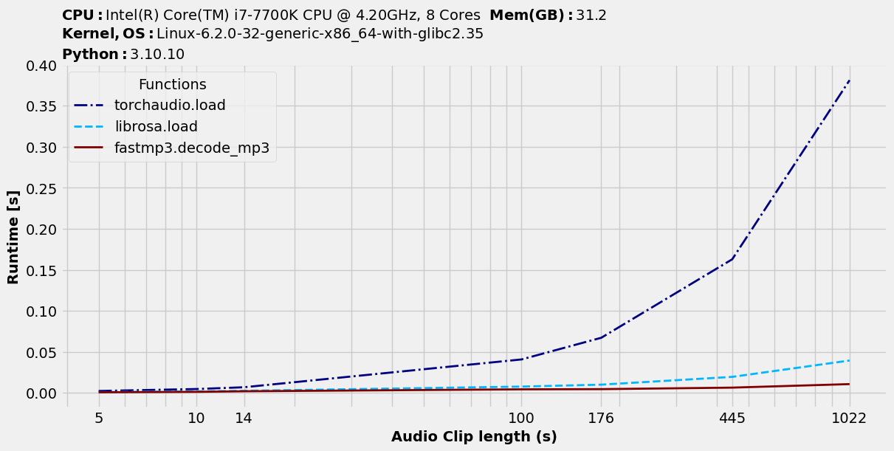
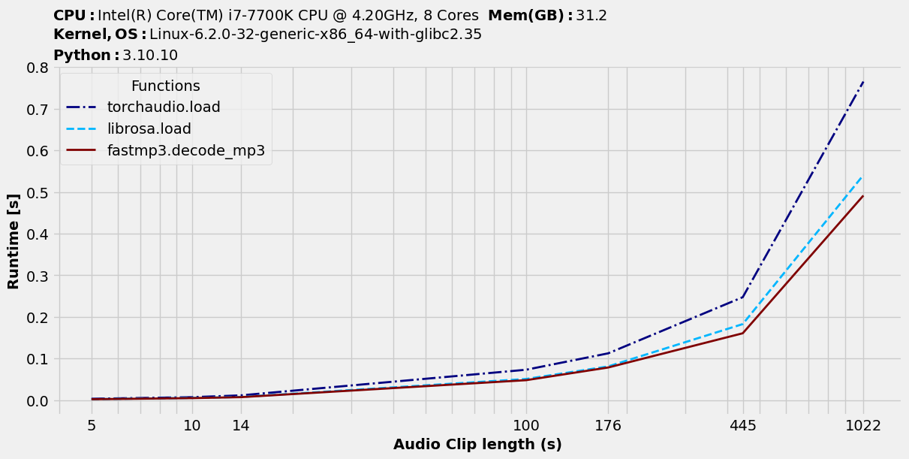

# FastMP3

Library for fast decoding of MP3 files, that supports seeking. It binds the [minimp3](https://github.com/lieff/minimp3) 
library to Python using NumPy's C-Types foreign function interface.

## Open & Decode MP3 files
The `decode_mp3` function decodes an MP3 file to a numpy array. 
It expects either a path to an MP3 file or a byte array containing the MP3 file. 
The function returns a tuple with the following fields:

* `samples`: Numpy array with the decoded samples of shape `(samples, channels)` and dtype `float32`
* `sample_rate`: Sample rate in Hz

```python
from fastmp3 import decode_mp3

samples, sample_rate = decode_mp3("data/rain.mp3",
                                  offset=0.0,
                                  length=10.0)
# samples: array([[-2.0513689e-04], ..., [-2.0412763e-04]], dtype=float32)
# sample_rate: 32000
```

## Probe MP3 files

To get meta information about the MP3 file use the `probe_mp3` function. It returns a `ProbeOutput` object with the following fields:

- `samples`: Number of samples in the MP3 file
- `channel`: Number of channels
- `sample_rate`: Sample rate in Hz
- `bitrate_kbps`: Average bitrate in kbps

```python
from fastmp3 import probe_mp3

probe = probe_mp3("data/rain.mp3")
# ProbeOutput(samples=14264320, channel=1, sample_rate=32000, bitrate_kbps=40)
```

## Encode MP3 files

To encode any audio file to MP3 use the `encode_mp3` function. It simply utilizes the `ffmpeg` library to encode the audio file.

```python
from fastmp3.utils import encode_mp3

encode_mp3("audio.wav", encoding='vbr', audio_bitrate=4, mono=True, sample_rate=32000)
```


## Advanced usage

For advanced usage you can use the `_probe_mp3_array` and `_decode_mp3_array` functions directly. This allows you to 
allocate the output array yourself and to decode MP3 files from a byte array.

```python
import numpy as np
from fastmp3.libmp3 import _probe_mp3_array, _decode_mp3_array

raw = np.fromfile("data/rain.raw", dtype=np.uint8)
probe = _probe_mp3_array(raw)

out = np.empty(shape=(probe.samples, probe.channel), dtype=np.float32)
_decode_mp3_array(raw, out)
```

## Benchmarks
<p align="center">

|                    Benchmark | Min     | Max     | Mean    | Min (+)         | Max (+)         | Mean (+)        |
|------------------------------|---------|---------|---------|-----------------|-----------------|-----------------|
| Seek: FastMP3 vs. torchaudio | 44.637  | 46.107  | 45.233  | 1.644 (27.1x)   | 1.656 (27.8x)   | 1.649 (27.4x)   |
|    Seek: FastMP3 vs. librosa | 4.737   | 4.814   | 4.777   | 1.661 (2.9x)    | 1.693 (2.8x)    | 1.674 (2.9x)    |
|       FastMP3 vs. torchaudio | 11.253  | 14.043  | 12.772  | 7.542 (1.5x)    | 7.628 (1.8x)    | 7.594 (1.7x)    |
|          FastMP3 vs. librosa | 8.551   | 9.399   | 8.836   | 7.470 (1.1x)    | 7.660 (1.2x)    | 7.552 (1.2x)    |

</p>
<p align="center">
    
</p>

<p align="center">
    
</p>

## Acknowledgements

This library is based on the [minimp3](https://github.com/lieff/minimp3) library.

This libray was mainly developed for deep learning applications.